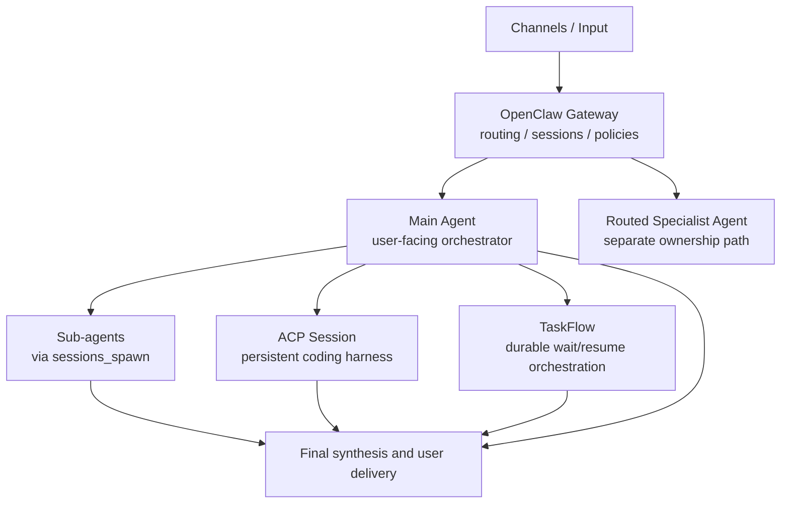

# OpenClaw Orchestration Layers

How to think about **multi-agent** and **orchestrator** design in OpenClaw without overcomplicating the starting architecture.

This document describes the **advanced architecture map** around the repo's default model, which is still:

- Quả Quả as the user-facing orchestrator
- bounded native sub-agents as the default delegation mechanism

## Short version

OpenClaw does not have just one kind of orchestrator.
It has several layers that solve different problems:

1. **Gateway routing** for deciding which agent/session should receive inbound work.
2. **Sub-agents and sessions** for bounded delegation.
3. **ACP sessions** for longer-lived coding harness work.
4. **TaskFlow** for durable jobs that need waiting, resume, and child-task linkage.

The most practical default is still:

- one user-facing orchestrator
- bounded spawned specialists
- centralized synthesis and delivery

Then add ACP or TaskFlow only when the workload proves you need them.

## The layers

### 1. Gateway routing layer

Use this layer when you need to decide **which agent gets the message**.

Typical uses:

- route Telegram DMs to one main assistant
- route a dev group or ops channel to a different agent
- isolate workspaces, identities, or policies by channel/account/peer

Think of this as **traffic orchestration**.
It is about who owns the conversation entrypoint, not how a single job is executed internally.

### 2. Session and sub-agent layer

Use this layer when one main agent needs help with bounded work.

Typical uses:

- research fan-out
- codebase scanning
- compare options in parallel
- implementation of a clearly scoped chunk
- second-pass review

This is the default OpenClaw-native delegation model:

- main agent receives the request
- main agent spawns specialists with `sessions_spawn`
- specialists return scoped results
- main agent synthesizes the final answer

Think of this as **job orchestration for bounded child runs**.

### 3. ACP layer

Use this layer when work belongs in a **persistent coding harness session** instead of a one-off child run.

Typical uses:

- Codex or Claude Code threads
- Cursor or Gemini CLI sessions
- longer-lived coding conversations
- harness-native workflows where session continuity matters

ACP is a better fit than normal sub-agents when the external harness itself is the real runtime you want to keep alive.

Think of this as **harness orchestration**.

### 4. TaskFlow layer

Use this layer when the work should behave like **one durable job with memory of its own lifecycle**.

Typical uses:

- work that spans more than one turn
- jobs that wait on detached child tasks
- jobs that need `waiting`, `resume`, `cancel`, or `finish` semantics
- flows that should survive longer than one immediate reply

TaskFlow owns:

- flow identity
- persisted state
- waiting state
- linked child tasks
- revision-safe mutations

Think of this as the closest thing to a **durable orchestrator substrate** in OpenClaw.

## Recommended progression

### Stage 1

**One main agent only**

Use when:

- the workload is still simple
- the human mostly wants one strong assistant
- delegation would add more ceremony than value

### Stage 2

**Main agent plus sub-agents**

Use when:

- work is parallelizable
- tasks are bounded and reviewable
- specialist isolation improves quality

This is the recommended starting point for most real builds.

### Stage 3

**Main agent plus ACP session for coding**

Use when:

- coding work needs a persistent harness session
- thread continuity matters
- you want OpenClaw to route into an ACP-aware runtime instead of a generic child run

### Stage 4

**TaskFlow-managed jobs**

Use when:

- jobs have lifecycle beyond one turn
- the agent must wait and resume later
- several child tasks still belong to one owner-visible job

### Stage 5

**Gateway-routed multi-agent system**

Use when:

- different domains need separate identities or workspaces
- different channels should land in different agents
- isolation and policy separation matter more than simplicity

## Practical rule of thumb

If you are not sure which layer to use:

- use **sub-agents** for bounded parallel help
- use **ACP** for persistent coding-harness conversations
- use **TaskFlow** for durable multi-step jobs
- use **gateway routing** when the conversation should belong to a different agent from the start

## Architecture diagram

### Simple text view

```text
Channels / Input
        |
        v
OpenClaw Gateway
  routing / sessions / policies
        |
        +-----------------------------+
        |                             |
        v                             v
   Main Agent                    Routed Specialist Agent
        |
        +--> Sub-agents via sessions_spawn
        |
        +--> ACP session for coding harness work
        |
        +--> TaskFlow for durable wait/resume orchestration
        |
        v
 Final synthesis and user delivery
```

### Mermaid view



## Decision table

| Need | Best starting layer |
|---|---|
| One assistant should answer directly | Main agent only |
| Bounded parallel research or implementation | Sub-agents |
| Persistent coding thread or harness session | ACP |
| Long-running job with waiting/resume/cancel | TaskFlow |
| Different channels should belong to different agents | Gateway routing |

## Why this repo stays conservative by default

This template intentionally avoids starting with deep nesting or many always-on specialists.

That is not because OpenClaw cannot support more complexity.
It is because the highest-leverage default is usually:

- one coherent user-facing assistant
- bounded delegation only when needed
- explicit ownership of final delivery
- gradual evolution into stronger orchestration layers as the workload proves the need

## Suggested reading order in this repo

1. `README.md`
2. `ORCHESTRATION_WORKFLOW.md`
3. `docs/SUBAGENT_PLAYBOOK.md`
4. `docs/OPENCLAW_SUBAGENT_SETUP.md`
5. this file

## Source notes

This document is based on the current OpenClaw local docs/runtime guidance around:

- multi-agent routing
- `sessions_spawn` and sub-agent control
- ACP runtime patterns
- TaskFlow as the durable flow substrate

It is intended as a practical architecture map, not a full runtime reference.
